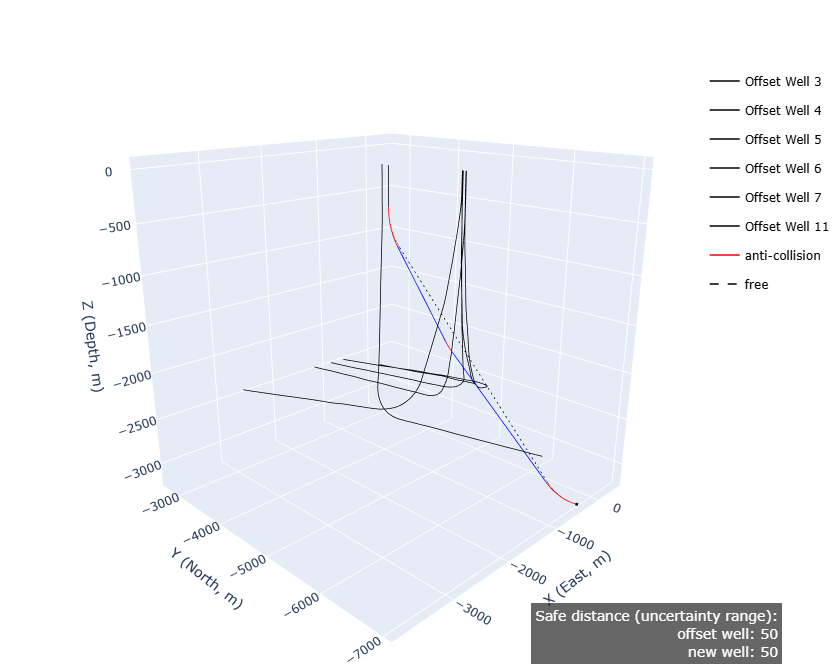
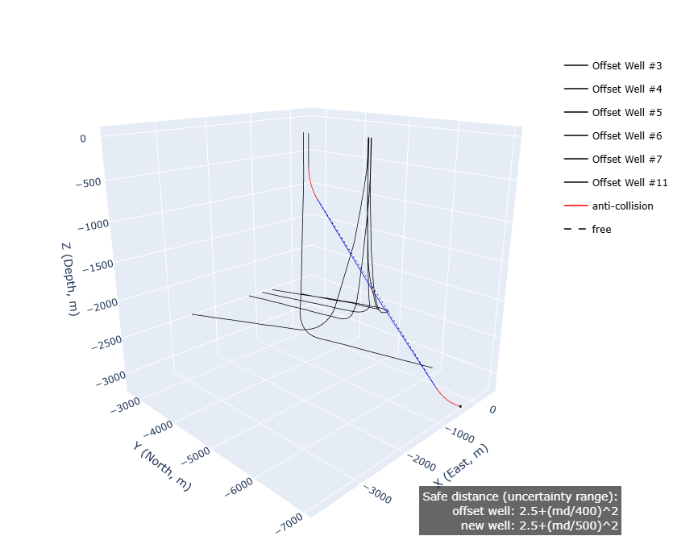

# Anticollision-Paper-data
This repository provides the data for the anticollision paper.

## Case 3.1_1 Anticollision trajectory with a fixed MASD (MASD=100)

## Case 3.1_2 Anticollision trajectory with a dynamic MASD function

## Case 3.2 Anticollision trajectory with EOU semi-major error of offset wells 